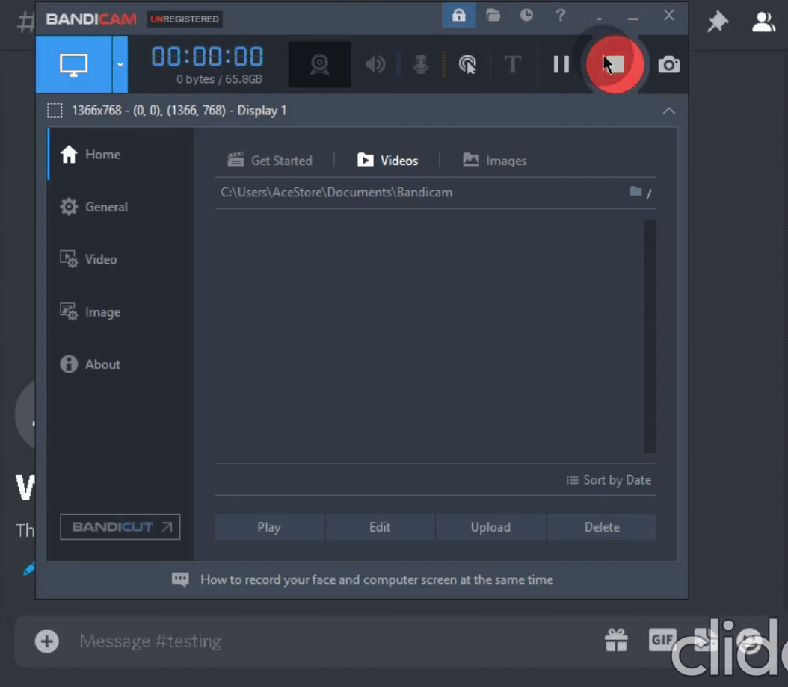

# 🎏 INSTALATIONS 🎏
you need first ```npm install``` and then ```node index.js```

# Visit Our Websites and Bots
https://frenzybotdev.odoo.com

Visit Our Discord bot (Used by 5k User)
https://top.gg/bot/880306203253698631

Visit Our 2nd bot (99 Servers)
https://top.gg/bot/884970658004619294

## ☀ TULISAN BAHASA INDONESIA :)
jika anda menginstall package menggunakan ``setup.bat`` kemungkinan besar anda akan mengalami error seperti bacaan di paling atas!,
saya saran kan anda menginstall package dengan cara :
- **BUKA REPLIT DI BROWSER**
- ketik dalam console :
``npm install``
- jika sudah kalian bisa ``node index.js`` dan jangan lupa ya untuk mengisi token anda di  ``config.json``

## 🌙 TERIMA KASIH
terima kasih telah menggunakan source project ini,
semua di tulis resmi asli dari indonesia!
semoga source project dapat digunakan dengan baik
saya harap tidak ada error di semua perangkat (tidak termasuk android karna tidak bekerja),
jika anda mengalami error saat running script ini, mohon baca message yang paling atas,
jika ada masalah baru tetapi tidak dijelaskan oleh saya bagaimana cara memperbaikinya, anda bisa post itu di issue!
    
## ✨ Contributors ✨
<table>
  <tr>
<td align="center"><a href="https://github.com/FrenzY8"
<sub><b>FrenzYSG</b></sub><br /></td>
  </tr>
</table>
<table>
  <tr>
<td align="center"><a href="https://github.com/icrawl"
<sub><b>iCrawl</b></sub><br /></td>
  </tr>
</table>

# ✨ NOTES ✨
the node_modules sometime can error, so i told you to ```npm install``` for once again, after clone this  bot

# ✨ PREVIEWS ✨
<p align="center">

<a align="center">
  
# v1.3
  Currently Versions
